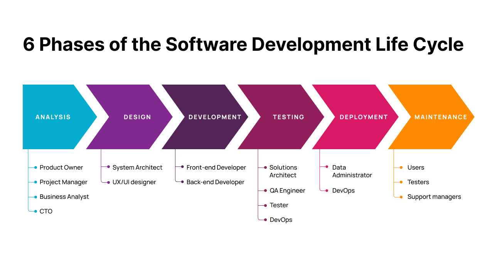

###### [You](./you/index.md)

###### [Software Architecture](architect/Design/software_design.md)

###### [Design Patterns for Humans](https://roadmap.sh/guides/design-patterns-for-humans)

###### [Design First](./designfirst/README.md)

###### [Checklist for good design](./designfirst/checklist.md)

###### [Developers](./developer/index.md)

###### [Fun and Cool](./fun%20and%20cool/index.md)

###### [Solution Architecture patterns](./fun%20and%20cool/index.md)

###### [Machine Learning](./ai/machine_learning/index.md)

##### illustrations and templates for developers, designers and architects

